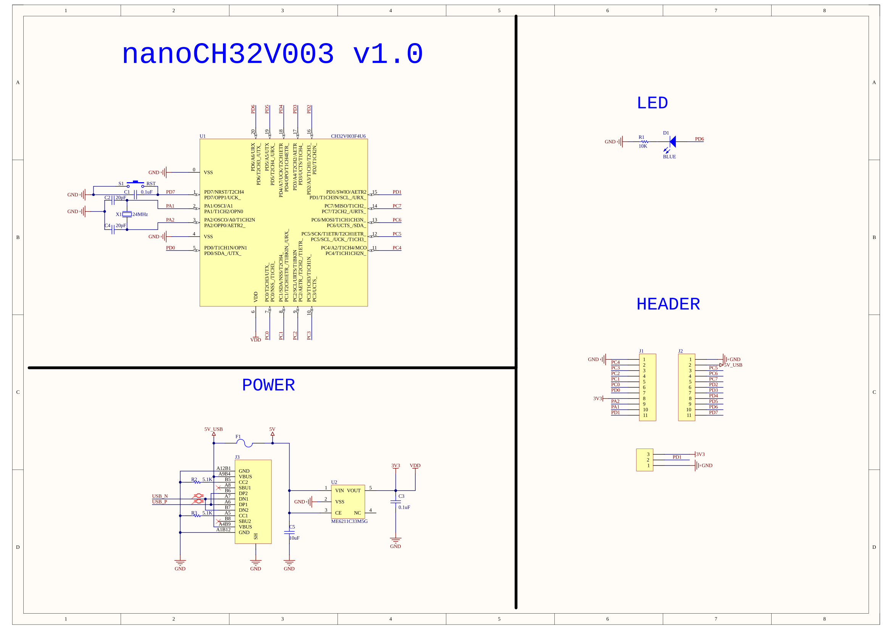

# NiMh Battery Charger for 4 AA/AAA batteries

Idea taken from BigClive:
[https://www.reddit.com/r/BigCliveDotCom/comments/tcny85/simple_nimh_battery_charger_with_pcb_files/]

In order to know when the batteries might be charged my plan was to use the timer and a LED. 
I need a 24 hour timer and 555 adds more complications and cannot have 24 hours delays.
Then I tried to get a more modern timer solution but at the end it's much cheaper to use cheap MCU.
That seems wastefull to use MCU only as a timer so I'll ad some fluff to it and maybe connect more batteries to one.

For detecting battery and the timers used ch32v003fun:
[https://github.com/cnlohr/ch32v003fun?tab=readme-ov-file]

Example of the dev board:
[https://oshwlab.com/wagiminator/ch32v003f4p6-development-board]

Development board github:
[https://github.com/wuxx/nanoCH32V003]

To use the WCH-LinkE on Linux, you need to grant access permissions beforehand by executing the following commands:

```shell
echo 'SUBSYSTEM=="usb", ATTR{idVendor}=="1a86", ATTR{idProduct}=="8010", MODE="666"' | sudo tee /etc/udev/rules.d/99-WCH-LinkE.rules
echo 'SUBSYSTEM=="usb", ATTR{idVendor}=="1a86", ATTR{idProduct}=="8012", MODE="666"' | sudo tee -a /etc/udev/rules.d/99-WCH-LinkE.rules
sudo udevadm control --reload-rules

```


To upload firmware and perform debugging, you need to ensure that the development board is disconnected from any power sources. Then, you should make the following connections to the WCH-LinkE:
```
| WCH-LinkE |      | DevBoard |
|-----------|------|----------|
|  SWDIO    | <--> |DIO       |
|    3V3    | ---> |3V3       |
|    GND    | ---> |GND       |

```
## NRST [D7] pin AS GPIO
Must be configured to be GPIO and not NRST pin
```shell
./minichlink -D
```

## Quick reference


## Dev board pinout


## Dev board schematic 

